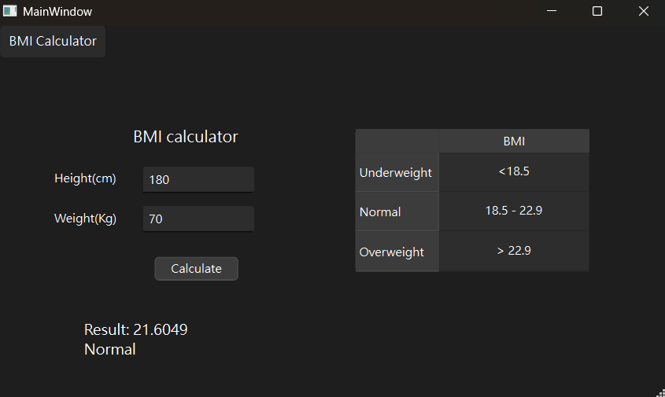

# BMI Calculator

A simple BMI (Body Mass Index) Calculator built using Qt Framework. This application allows users to input their height and weight to calculate their BMI and provides feedback on their BMI category.

## 📦Features
- Input validation for height and weight using `QDoubleValidator`.
- Calculates BMI based on the formula:
  \[ BMI = \frac{weight (kg)}{(height (m))^2} \]
- Displays categorized results:
  - **Underweight**: BMI < 18.5
  - **Normal**: 18.5 ≤ BMI < 22.9
  - **Overweight**: BMI ≥ 22.9

## 🚀Prerequisites
To run or build this project, you need:
- **Qt Framework** (5.x or later)
- **C++ Compiler** (e.g., GCC, MSVC)

## ⚙️How to Build
1. Clone the repository:
   ```bash
   git clone https://github.com/yourusername/BMI-Calculator.git
   cd BMI-Calculator
   ```

2. Open the project in Qt Creator:
   - Open the `BMI-Calculator.pro` file in Qt Creator.

3. Build and Run the project:
   - Press `Ctrl + R` or click the `Run` button in Qt Creator to build and execute the application.

## ⚙️Usage
1. Enter your height (in centimeters) in the `Height` input field.
2. Enter your weight (in kilograms) in the `Weight` input field.
3. Click the **Calculate** button.
4. View your BMI result and category in the result label.

## 📂File Structure
```
BMI-Calculator/
├── picture/
│   ├── main.cpp
│   ├── mainwindow.h
│   ├── mainwindow.cpp
│   ├── mainwindow.ui
│   └── README.md
└── picture/
    └── sample.png
```

## Screenshots


## Limitations
- This application uses basic BMI categories and does not account for age, gender, or other health factors.

## Contribution
Contributions are welcome! Feel free to fork this repository, make improvements, and create a pull request.

## **📬Contact**
For questions or suggestions, feel free to contact:   
Email: ghuang24@gmail.com  

---
Thank you for using this BMI Calculator! If you encounter any issues or have suggestions for improvement, please open an issue on GitHub.